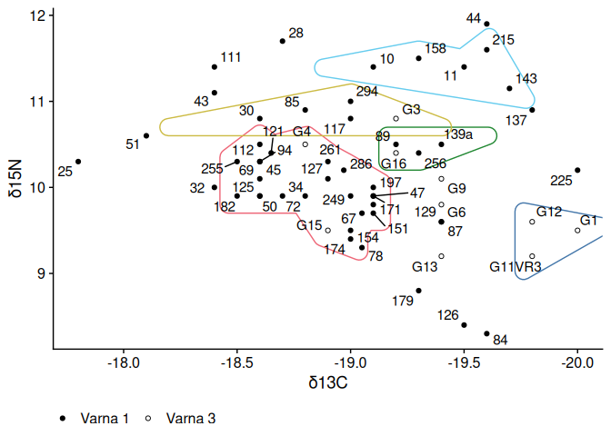

# Dietary variability in the Varna Chalcolithic cemeteries

This is a compendium of data and R code accompanying [our
paper](https://doi.org/10.1017/eaa.2024.33):

> Gaydarska, Bisserka, Joe Roe, and Vladimir Slavchev. 2024. Dietary
> Variability in the Varna Chalcolithic Cemeteries. *European Journal of
> Archaeology*. <https://doi.org/10.1017/eaa.2024.33>

It describes a cluster analysis of dietary stable isotope measurements
from burials at Varna, a Chalcolithic cemetery on the Black Sea coast of
modern-day Bulgaria.

We delineated clusters of burials with similar stable isotope ratios
using the HDBSCAN algorithm (Campello, Moulavi, and Sander 2013) with
$m_{pts}=3$. HDBSCAN (Hierarchical Density-Based Spatial Clustering of
Applications with Noise) is an non-parametric clustering and outlier
detection algorithm that seeks the ‘most stable’ clusters in a given
dataset. In other words, it selects those natural clusters in the data
that are least affected by the choice of a particular density or
distance threshold. HDBSCAN is well-suited to stable isotope data
because it performs well with non-linear clusters, is robust to noise,
and doesn’t rely on a pre-specified number of desired clusters (Campello
et al. 2015). We applied the modified algorithm suggested by Malzer and
Baum (2020), where clustering below a certain threshold distance is
ignored. In our case, we selected this threshold to collapse together
clusters that were only visible at distances under the maximum
measurement error of the isotope ratios (0.03). Clustering was performed
with the R package dbscan (Hahsler, Piekenbrock, and Doran 2019); the
data and R code to reproduce this analysis is deposited with Zenodo at
<https://doi.org/10.5281/zenodo.11203468>.

## Usage

`varna_diet_clustering.R` contains the R code that performs the cluster
analysis. It uses `data/varna_human_isotopes.xlsx`, which is excerpted
from the paper (Table 1). `data/varna_human_isotopes.csv` contains the
extracted and cleaned data used for clustering.

`renv.lock` records the exact dependency versions used to produce our
analysis. You can restore this environment with
[renv](https://rstudio.github.io/renv/articles/renv.html) using
`renv::init()`.

## Citation

Please cite the original paper which this compendium accompanies:

> Gaydarska, Bisserka, Joe Roe, and Vladimir Slavchev. 2024. Dietary
> Variability in the Varna Chalcolithic Cemeteries. *European Journal of
> Archaeology*. <https://doi.org/10.1017/eaa.2024.33>

## License

Code: MIT License  
Paper: CC BY-SA

## References

Campello, Ricardo J. G. B., Davoud Moulavi, and Joerg Sander. 2013.
“Density-Based Clustering Based on Hierarchical Density Estimates.” In
*Advances in Knowledge Discovery and Data Mining*, edited by Jian Pei,
Vincent S. Tseng, Longbing Cao, Hiroshi Motoda, and Guandong Xu, 160–72.
Lecture Notes in Computer Science. Berlin, Heidelberg: Springer.
<https://doi.org/10.1007/978-3-642-37456-2_14>.

Campello, Ricardo J. G. B., Davoud Moulavi, Arthur Zimek, and Jörg
Sander. 2015. “Hierarchical Density Estimates for Data Clustering,
Visualization, and Outlier Detection.” *ACM Transactions on Knowledge
Discovery from Data* 10 (1): 5:1–51. <https://doi.org/10.1145/2733381>.

Hahsler, Michael, Matthew Piekenbrock, and Derek Doran. 2019.
“dbscan: Fast Density-Based Clustering with
R.” *Journal of Statistical Software* 91 (1): 1–30.
<https://doi.org/10.18637/jss.v091.i01>.

Malzer, Claudia, and Marcus Baum. 2020. “A Hybrid
Approach To Hierarchical Density-based Cluster Selection.” In
*2020 IEEE International Conference on Multisensor Fusion and
Integration for Intelligent Systems (MFI)*, 223–28.
<https://doi.org/10.1109/MFI49285.2020.9235263>.

